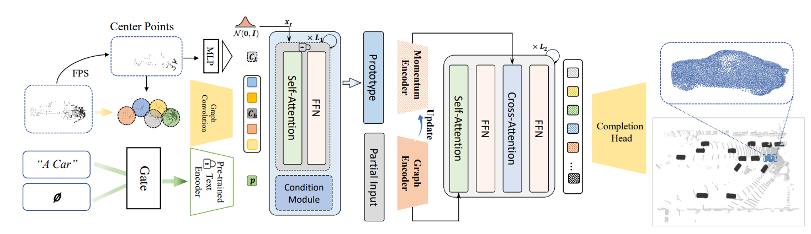

# ProtoComp: Diverse Point Cloud Completion with Controllable Prototype

Created by [Xumin Yu](https://yuxumin.github.io/), [Yanbo Wang](https://Yanbo-23.github.io/), [Jie Zhou](https://scholar.google.com/citations?user=6a79aPwAAAAJ&hl=en&authuser=1), [Jiwen Lu](https://scholar.google.com/citations?user=TN8uDQoAAAAJ&hl=zh-CN).


This repository is a pyTorch implementation of our ECCV 2024 paper **ProtoComp**.

**ProtoComp** is a prototype-based approach for completing partial point clouds in real-world scenarios by generating rough prototypes and enhancing them with finer geometry. It uses limited training data to adapt effectively to diverse environments, including indoor (ScanNet) and outdoor (KITTI) settings. The method introduces a new benchmark and metric for evaluating real-world performance, outperforming state-of-the-art methods on existing and novel benchmarks.


[[pdf](https://fq.pkwyx.com/default/https/www.ecva.net/papers/eccv_2024/papers_ECCV/papers/06685.pdf)]


## Installation
- Follow the [installation.md](installation.md) to install all required packages so you can do the training & evaluation afterwards.

## Data Preparation
The paper only uses two datasets for training: the entire PCN dataset and 8 * 100 randomly selected samples from ShapeNet. Therefore, only the download links for the PCN and ShapeNet datasets are provided here.

The overall directory structure should be:

```
│PoinTr/
├──cfgs/
├──datasets/
├──data/
│   ├──ShapeNet55/
│   ├──PCN/
├──.......
```
**PCN Dataset**: You can download the processed PCN dataset from [BaiduYun](https://pan.baidu.com/s/1Oj-2F_eHMopLF2CWnd8T3A)(code: hg24 ). The directory structure should be

```
│PCN/
├──train/
│  ├── complete
│  │   ├── 02691156
│  │   │   ├── 1a04e3eab45ca15dd86060f189eb133.pcd
│  │   │   ├── .......
│  │   ├── .......
│  ├── partial
│  │   ├── 02691156
│  │   │   ├── 1a04e3eab45ca15dd86060f189eb133
│  │   │   │   ├── 00.pcd
│  │   │   │   ├── 01.pcd
│  │   │   │   ├── .......
│  │   │   │   └── 07.pcd
│  │   │   ├── .......
│  │   ├── .......
├──test/
│  ├── complete
│  │   ├── 02691156
│  │   │   ├── 1d63eb2b1f78aa88acf77e718d93f3e1.pcd
│  │   │   ├── .......
│  │   ├── .......
│  ├── partial
│  │   ├── 02691156
│  │   │   ├── 1d63eb2b1f78aa88acf77e718d93f3e1
│  │   │   │   └── 00.pcd
│  │   │   ├── .......
│  │   ├── .......
├──val/
│  ├── complete
│  │   ├── 02691156
│  │   │   ├── 4bae467a3dad502b90b1d6deb98feec6.pcd
│  │   │   ├── .......
│  │   ├── .......
│  ├── partial
│  │   ├── 02691156
│  │   │   ├── 4bae467a3dad502b90b1d6deb98feec6
│  │   │   │   └── 00.pcd
│  │   │   ├── .......
│  │   ├── .......
├──PCN.json
└──category.txt
```


**ShapeNet55 Dataset**: You can download the processed ShapeNet55 dataset at [[BaiduCloud](https://pan.baidu.com/s/16Q-GsEXEHkXRhmcSZTY86A)] (code:le04) or [[Google Drive](https://drive.google.com/file/d/1jUB5yD7DP97-EqqU2A9mmr61JpNwZBVK/view?usp=sharing)], Unzip the file under `ShapeNet55/`.


The directory structure should be:
```
│ShapeNet55/
├──shapenet_pc/
│  ├── 02691156-1a04e3eab45ca15dd86060f189eb133.npy
│  ├── 02691156-1a6ad7a24bb89733f412783097373bdc.npy
│  ├── .......
├──ShapeNet-55/
│  ├── train.txt
│  └── test.txt
```

## CheckPoint
We provide two different checkpoints for **ProtoComp**, corresponding to **Table (b)** and **Table (c)** in the paper. You can download them to:

1. Perform [DEMO testing](#Demo).
2. Evaluate the model on our newly proposed [Real Sensors Benchmark](datasets/README.md).


| **Benchmark**         | **Fidelity / GD<sub><em>C</em></sub> / GD<sub><em>I</em></sub>** | **Download Link**       |
|-----------------------|-----------------------------------------------|--------------------------|
| **Full PCN Dataset**     | 20.6 / 40.8 / 43.6                            | [[Tsinghua Cloud]](https://cloud.tsinghua.edu.cn/f/90f4da27f0cb49e68929/?dl=1) [[Google]](https://drive.google.com/file/d/1_kMJh-QQI_Fnv14sT-YCelImW9rUpcj6/view?usp=sharing)       |
| **(8*100)-ShapeNet55 Dataset**     | 14.7 / 47.5 / 46.8                            | [[Tsinghua Cloud]](https://cloud.tsinghua.edu.cn/f/3a5b4282268b4b7ba612/?dl=1) [[Google]](https://drive.google.com/file/d/1gGvdPE1rm0mCoqc97vu-zLhURvBHqxpj/view?usp=sharing)      |
  

## Usage


### Training
**Init Control Weights Preparation**

Before starting training, you need to download the preprocessed control weights from the following links [[Tsinghua Cloud]](https://cloud.tsinghua.edu.cn/f/05d8463d20004c1fa6cb/?dl=1) [[Google]](https://drive.google.com/file/d/1HLIKadIwIWRjI6KJW7i7fD5zNoja6DfI/view?usp=sharing)
After downloading, save the file to `models/control_sd15_ini.ckpt`.
#### Training Command

```
CUDA_VISIBLE_DEVICES=<GPU_IDs> bash ./scripts/dist_train.sh <NUM_GPUs> <PORT> --config ${CONFIG_PATH} --exp_name <EXPERIMENT_NAME> --init_weights <WEIGHTS_PATH> 
```
#### Parameters

- **`<NUM_GPUs>`**  
  Number of GPUs to use for training. This should match the number of GPUs specified in `CUDA_VISIBLE_DEVICES`.  

- **`--config <CONFIG_PATH>`**  
  Specifies the path to the configuration file for the model and training task.  

- **`--exp_name <EXPERIMENT_NAME>`**  
  Name for the current experiment to organize logs and results.  `

- **`--init_weights <WEIGHTS_PATH>`**  
  Path to the initial control weights file.  


#### Example
```bash
CUDA_VISIBLE_DEVICES=0,1,2,3,4,5,6,7 bash ./scripts/dist_train.sh 8 13232 \
--config cfgs/PCN_models/ProtoComp.yaml \
--exp_name example \
--init_weights models/control_sd15_ini.ckpt
```
### Demo
To help you quickly test and experience the model's powerful imagination in point cloud completion tasks, we provide a **DEMO script** for your convenience. 🎉 This allows you to effortlessly explore its capabilities and see the results in action. You can either use our **pre-trained model** or train your own. 
#### 🌟 **Just a Little Tip!**  

✨ If you want to experience a more **imaginative and powerful model capability**, we *highly recommend* using the **model checkpoint** we provide (or training from scratch) on the **complete PCN dataset**. 🛠️ With its **rich and diverse data volume**, the model becomes more capable of **generalization** and **divergent thinking**. 💡  

📌 Once everything is set up, you can simply follow the **easy-to-use commands** below. The model will take your provided descriptions and **incomplete point clouds**, then generate **reasonable** and **imaginative** point cloud completions! 🎨✨  


#### Get Started in Seconds 🚀  
Run the following command to start exploring:


```bash
CUDA_VISIBLE_DEVICES=${GPUS} python main.py \
    --demo \                 # DEMO Mode
    --ckpts ${CKPTS} \       # Path to pre-trained model checkpoints
    --config ${CONFIG} \     # Configuration file for the model
    --exp_name ${EXP_NAME} \ # Name of the experiment
    --pc_path ${PC_PATH} \   # Path to the input point cloud
    --save_path ${SAVE_PATH} \ # Path to save the output
    --prompt ${PROMPT}     # Text prompt for the model
```
#### Example
```
CUDA_VISIBLE_DEVICES=0 python main.py --demo --ckpts "experiments/ProtoComp/PCN_models/test/ckpt-best.pth" --config "cfgs/PCN_models/ProtoComp.yaml" --exp_name "example" --pc_path "data/real_sensors_benchmark/bathtub/bathtub_000.pcd" --save_path "./vis" --prompt "A bathtub"    
```
### Evaluation on Real Sensors Benchmark
- To download datasets and perform evaluations, follow the instructions provided in the [Real Sensors Benchmark README](datasets/README.md)

## Citation
If you find this code useful for your research, please cite our papers.
@inproceedings{yu2025protocomp,
  title={ProtoComp: Diverse Point Cloud Completion with Controllable Prototype},
  author={Yu, Xumin and Wang, Yanbo and Zhou, Jie and Lu, Jiwen},
  booktitle={European Conference on Computer Vision},
  pages={270--286},
  year={2025},
  organization={Springer}
}
